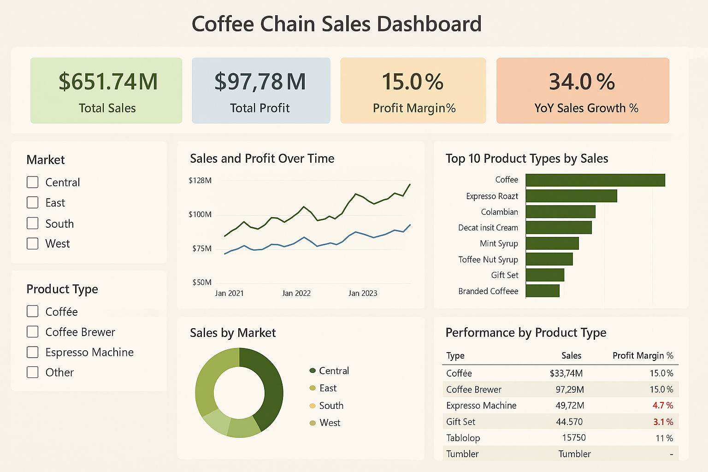

# ☕ Coffee Chain Sales Dashboard

An interactive Power BI dashboard designed to analyze sales, profit, and product performance across regional markets for a fictional coffee chain, using data from January 2021 to January 2024.

---

## 📌 Dashboard Objectives
- Track key business KPIs (Sales, Profit, Margin, Growth)
- Analyze sales performance over time
- Identify top-selling products and regions
- Enable stakeholder interactivity with slicers

---

## 📊 Key Metrics
| Metric               | Value      |
|----------------------|------------|
| 💰 Total Sales        | $651.74M   |
| 📈 Total Profit       | $97.78M    |
| 📊 Profit Margin      | 15.0%      |
| 🚀 YoY Sales Growth   | 34.0%      |

---

## 📁 Files Included
- `coffee-chain-dashboard.png` – Image of the final dashboard
- `Coffee-Chain-Sales-Dashboard.pptx` – Gamma-style stakeholder summary
- `Coffee_Chain_Sales.csv` *(Not uploaded to GitHub yet)* – Raw dataset
- `.pbix` file *(optional)* – Power BI file if you'd like to include it

---

## 💡 Insights
- **Top-performing product:** Coffee & Espresso Roast
- **Low-margin alert:** Espresso Machines & Gift Sets
- **Underperforming markets:** Central & West
- **Actionable focus:** Expand in weaker regions, review margins, forecast 2025

---

## 🚀 Next Steps
1. Add forecasting visuals to dashboard
2. Share report via Power BI Service
3. Integrate feedback from business users
4. Explore dashboard automation with Power Automate

---

## 🧑‍💻 Created With
- Power BI Desktop
- Excel / CSV data prep

---

